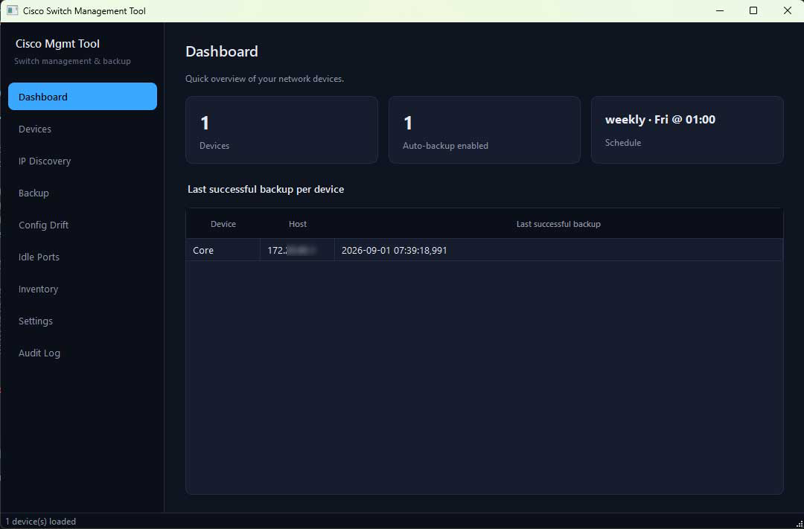
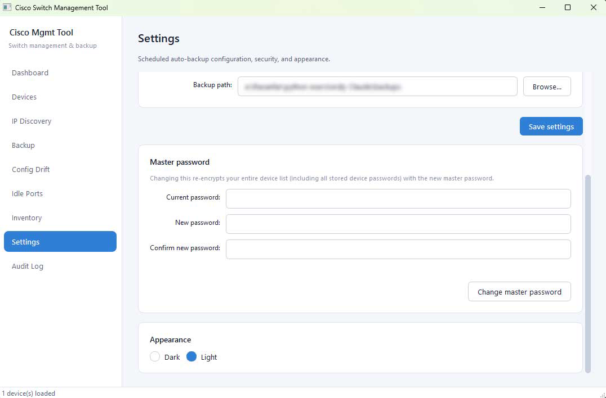
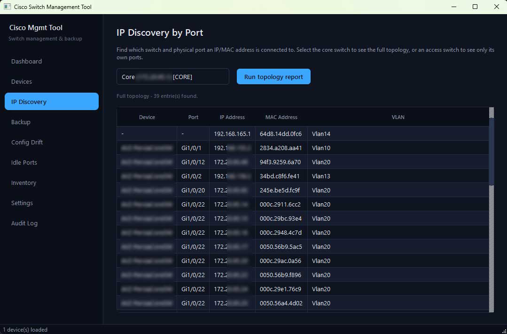

# Cisco Switch Management Tool

A Windows-friendly Python tool for managing Cisco (and other vendor) switches: topology/IP discovery, encrypted config backup with scheduling, config drift detection, idle-port security reports, and a device inventory report — available both as a **CLI** and a full **desktop GUI**.

> Built and tested primarily against Cisco IOS/IOS-XE switches, with optional support for non-Cisco devices (Mikrotik, HP/Aruba, Juniper, Arista, ...) via a custom backup command per device.

## Features

- **Topology / IP discovery** — find which switch and physical port an IP or MAC address is connected to, by walking CDP neighbors from a core switch.
- **Encrypted device storage** — all device credentials are encrypted at rest (Fernet + PBKDF2, 390k iterations) behind a single master password.
- **Scheduled + on-demand backup** — daily/weekly/monthly auto-backup with retention, plus one-off manual backups. Non-Cisco devices use a custom backup command instead of Cisco-specific parsing.
- **Config drift detection** — diff the two most recent backups of a device (or all devices) to catch unexpected/unauthorized changes.
- **Idle ports report** — flag `notconnect` and `err-disabled` ports, plus ports that are `connected` but have shown no traffic since the last check (candidates for security hardening).
- **Device inventory report** — model, serial number, and running IOS version for every device, with a reminder to check Cisco's own site for the latest release.
- **Security audit log** — a dedicated, rotating `security_audit.log` tracks master-password attempts, device changes, backup results, config drift, and more (never logs actual passwords/secrets).
- **Unattended startup on Windows** — securely save the master password via Windows DPAPI so scheduled backups can run headlessly from Task Scheduler at boot, with no one needing to type a password.
- **Full GUI** — a PySide6 desktop app covering every feature above, with light/dark themes.

## Screenshots

### Dashboard


### Login


### Settings


### IP Discovery


## Requirements

- Python 3.11+ (Windows recommended; the CLI is cross-platform, `pywin32`-based features are Windows-only)
- See [`requirements.txt`](requirements.txt) for Python packages

Install dependencies:

```bash
pip install -r requirements.txt
```

## Usage

### CLI

```bash
python cisco_mgmt.py
```

You'll be prompted for a master password (used to encrypt/decrypt your device list — 3 attempts before the app exits). From there, a numbered menu covers device management, backup, config drift, idle ports, inventory, and exit.

To run scheduled backups unattended (e.g. via Windows Task Scheduler), see "Backup > Enable unattended startup" in the CLI menu — it prints the exact command to register.

### GUI

```bash
python gui_app.py
```

All project files must be in the **same folder** (no subfolders) — the GUI imports the CLI's backend modules directly.

## Project layout

```
cisco_mgmt.py               Core backend: topology scan, backup, drift, idle ports, inventory, CLI menu
device_manager.py           Encrypted device storage + CRUD
backup_settings.py          Scheduled backup configuration
audit_log.py                Security audit log
windows_credential_store.py DPAPI-based master password storage (Windows-only)
app_paths.py                 Resolves the app's data directory correctly, script or frozen .exe

gui_app.py                  GUI entry point
gui_theme.py                 Dark/light QSS stylesheet
gui_widgets.py               Custom widgets (e.g. SteppedSpinBox)
gui_workers.py                Background-thread helper for blocking SSH calls
gui_log_bridge.py             Routes backend logging into the GUI console
gui_preferences.py            GUI-only settings (theme choice)
gui_dialogs.py                Unlock screen + device add/edit dialog
gui_main_window.py            Main window, sidebar navigation
gui_pages_*.py                One file per page (Devices, Backup, Config Drift, Idle Ports,
                               Inventory, IP Discovery, Settings, Audit Log)
```

## Building a standalone Windows .exe

See [`BUILD.md`](BUILD.md) for step-by-step PyInstaller instructions for both the CLI and GUI.

## Security notes

- The device list (`devices.enc`) is encrypted with a key derived from your master password. **If you lose the master password, the device list cannot be recovered.**
- `security_audit.log` never contains passwords or secrets — only event types, device names/hosts, and timestamps.
- "Unattended startup" trades password-prompt security for automation: once enabled, anyone who can run code as your Windows user can decrypt the device list. Only enable it on a machine/account you control.
- Never commit `devices.enc`, `devices.salt`, `master_password.dpapi`, `backup_settings.json`, `gui_preferences.json`, or any `*.log` file to version control — see [`.gitignore`](.gitignore).

## License

MIT — see [`LICENSE`](LICENSE). Replace `[Your Name]` in that file with your name (or organization) before publishing.

## Contributing

Issues and pull requests are welcome. Please avoid including real device credentials, IPs, or hostnames in any issue/PR content.
